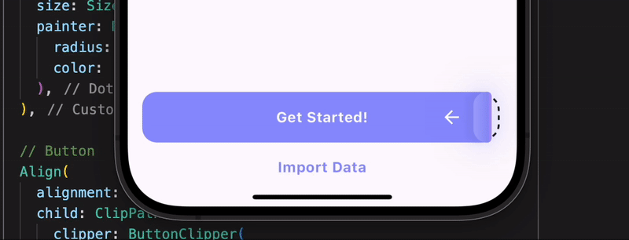

# Peel Widget
A very satisying widget that can be peeled to perform a action.

## Usage

Just import the package and use it without any required arguments.

```dart
Column(
    children: [
        PeelWidget(),
    ],
),
```



## Additional information

This widget supports customization to some degree but a full fledged package is coming soon!
